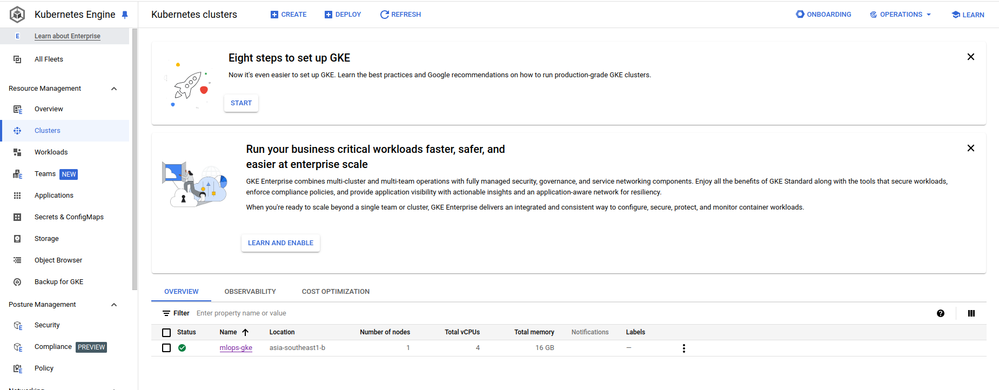
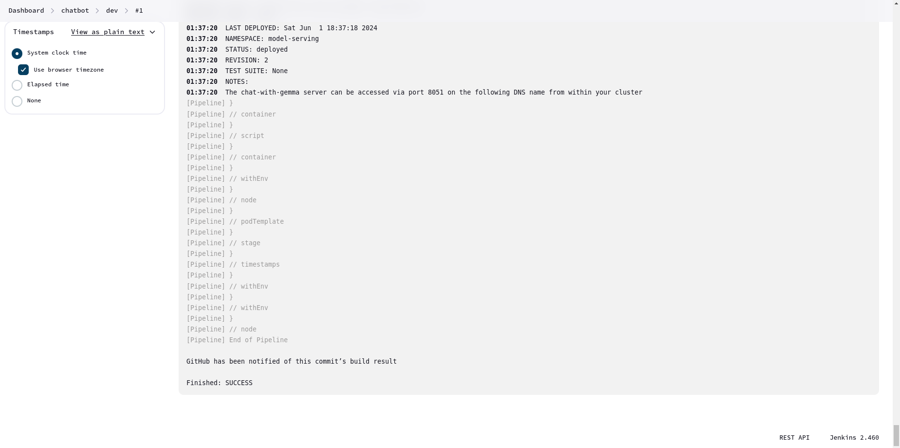
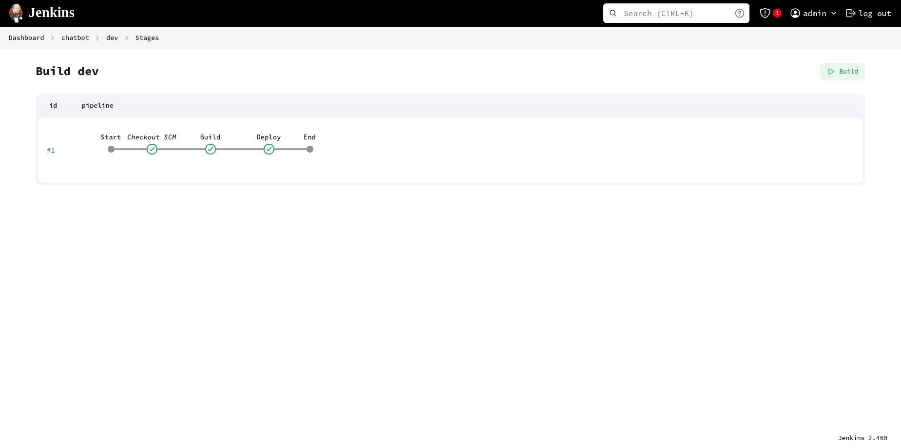

# Simple CI/CD pipeline for LLM in production using Google Kubernetes Engine.
## System Architecture

# Table of Contents

1. [Create GKE Cluster](#1-create-gke-clusterCreate-GKE-Cluster)
2. [Deploy serving service manually](#2-deploy-serving-service-manually)

    1. [Deploy nginx ingress controller](#21-deploy-nginx-ingress-controller)

    2. [Deploy application](#22-deploy-application-to-gke-cluster-manually)

3. [Deploy monitoring service](#3-deploy-monitoring-service)

    1. [Deploy Prometheus service](#31-deploy-prometheus-service)

    2. [Deploy Grafana service](#32-deploy-grafana-service)


4. [Continuous deployment to GKE using Jenkins pipeline](#4-continuous-deployment-to-gke-using-jenkins-pipeline)

    1. [Create Google Compute Engine](#41-spin-up-your-instance)

    2. [Install Docker and Jenkins in GCE](#42-install-docker-and-jenkins)

    3. [Connect to Jenkins UI in GCE](#43-connect-to-jenkins-ui-in-compute-engine)

    4. [Setup Jenkins](#44-setup-jenkins)

    5. [Continuous deployment](#45-continuous-deployment)
## 1. Create GKE Cluster
### How-to Guide

#### 1.1. Create [Project](https://console.cloud.google.com/projectcreate) in GCP
#### 1.2. Install gcloud CLI
Gcloud CLI can be installed following this document https://cloud.google.com/sdk/docs/install#deb

Initialize the gcloud CLI
```bash
gcloud init
Y
```
+ A pop-up to select your Google account will appear, select the one you used to register GCP, and click the button Allow.

+ Go back to your terminal, in which you typed `gcloud init`, pick cloud project you using, and Enter.

+ Then type Y, type the ID number corresponding to **asia-southeast1-b** (in my case), then Enter.

#### 1.3. Install gke-cloud-auth-plugin
```bash
sudo apt-get install google-cloud-cli-gke-gcloud-auth-plugin
```

#### 1.4. Using [terraform](https://developer.hashicorp.com/terraform/tutorials/aws-get-started/install-cli) to create GKE cluster.
Update your [project id](https://console.cloud.google.com/projectcreate) in `terraform/variables.tf`
Run the following commands to create GKE cluster:
```bash
gcloud auth application-default login
```

```bash
cd iac/terraform
terraform init
terraform plan
terraform apply
```
+ GKE cluster is deployed at **asia-southeast1-b** with its node machine type is: **e2-standard-4** (4 CPU, 16 GB RAM and costs 128$/1month).
+ Unable [Autopilot](https://cloud.google.com/kubernetes-engine/docs/concepts/autopilot-overview) for the GKE cluster. When using Autopilot cluster, certain features of Standard GKE are not available, such as scraping node metrics from Prometheus service.

It can takes about 10 minutes for create successfully a GKE cluster. You can see that on [GKE UI](https://console.cloud.google.com/kubernetes/list)


#### 1.5. Connect to the GKE cluster.
+ Go back to the [GKE UI](https://console.cloud.google.com/kubernetes/list).
+ Click on vertical ellipsis icon and select **Connect**.
You will see the popup Connect to the cluster as follows

+ Copy the line `gcloud container clusters get-credentials ...` into your local terminal.

After run this command, the GKE cluster can be connected from local using [kubectx](https://github.com/ahmetb/kubectx).
```bash
kubectx [YOUR_GKE_CLUSTER_ID]
```
## 2. Deploy serving service manually
Using [Helm chart](https://helm.sh/docs/intro/install/) to deploy application on GKE cluster.

### How-to Guide

#### 2.1. Deploy nginx ingress controller
```bash
cd helm/nginx_ingress
kubectl create ns nginx-ingress
kubens nginx-ingress
helm upgrade --install nginx-ingress-controller .
```
After that, nginx ingress controller will be created in `nginx-ingress` namespace.

#### 2.2. Serving LLM using Huggingface TGI
+ Firstly, let create your huggingface account and a token with READ permission.
+ Next, let define `volume` (where you store your data) and `huggingface_api_token`.
```bash
export volume=<PLACE_WHERE_STORE_YOUR_DATA>
export HUGGINGFACEHUB_API_TOKEN=<YOUR_TOKEN>
```
+ Finally, serving your LLM ([LongDHo/TinyLlama](https://huggingface.co/LongDHo/TinyLlama) in my case) model with Huggingface TGI by docker.
```bash
docker run --gpus all --shm-size 1g -p 8080:80 -e HUGGING_FACE_HUB_TOKEN=$HUGGINGFACEHUB_API_TOKEN  -v $volume:/data ghcr.io/huggingface/text-generation-inference:1.4 --model-id LongDHo/TinyLlama
```

##### Notice:
To GKE cluster can access your TGI, your must forward your 8080 port, for examples:


#### 2.3. Deploy application to GKE cluster manually
Our chatbot is deployed by Langchain and Streamlit. First of all, let update helm/model-serving/values.yaml, replace huggingface_api_token by your Huggingface token and inference_server_url by your ngrok address in my case.
The UI can be accessed by the host which is defined in `helm/model-serving/templates/nginx-ingress.yaml`.

```bash
cd helm/model-serving
kubectl create ns model-serving
kubens model-serving
helm upgrade --install chatbot .
```

After that, application will be deployed successfully on GKE cluster. To test the api, you can do the following steps:

+ Obtain the IP address of nginx-ingress.
```bash
kubectl get ing
```

+ Add the domain name `mlops.chatbot.com` (set up in `helm/model-serving/templates/nginx-ingress.yaml`) of this IP to `/etc/hosts`
```bash
sudo nano /etc/hosts
[YOUR_INGRESS_IP_ADDRESS] mlops.chatbot.com
```

+ Open web brower and type `mlops.chatbot.com` to access the Streamlit UI and test the API.
    
  Here, users can upload pdf files which demonstrate about the topic supposed to discuss and start to chat.

## 3. Deploy monitoring service
I'm using Prometheus, Grafana, Loki, Tempo and OpenTelemetry for monitoring the health of both Node and pods that running application.

Prometheus will scrape metrics from both Node and pods in GKE cluster, Loki will collect logs, Tempo and OpenTelemetry will export traces. Subsequently, Grafana will show us all the logs, traces and metrics we need to monitor our systems.

Similar to Streamlit UI, Grafana UI can be accessed by the host which is defined in `helm/monitor/grafana-prometheus.yaml`.
### How-to Guide
Firstly, let go to `helm/monitor` directory.
```bash
cd helm/monitor
helm install monitor . -n observability
```

After that, to access Grafana UI, you can do the following steps:
+ Obtain the IP address of nginx-ingress.
```bash
kubectl get ing
```

+ Add the domain name `grafana.chatbot.monitor.com` (set up in `helm/monitor/grafana-prometheus.yaml`) of this IP to `/etc/hosts`
```bash
sudo nano /etc/hosts
[YOUR_INGRESS_IP_ADDRESS] grafana.chatbot.monitor.com
```

+ Open web brower and type `grafana.chatbot.monitor.com` to access the Grafana UI with user is admin and password is prom-operator.
    


## 4. Continuous deployment to GKE using Jenkins pipeline

Jenkins is deployed on Google Compute Engine using [Ansible](https://docs.ansible.com/ansible/latest/playbook_guide/playbooks_intro.html) with a machine type is **e2-highmem-4**.

### 4.1. Spin up your instance
Create your [service account](https://console.cloud.google.com/iam-admin/serviceaccounts), and select `Compute Admin` role (Full control of all Compute Engine resources) for your service account.

Create new key as json type for your service account. Download this json file and save it in `iac/ansible/secrets` directory.

Go back to your terminal, please execute the following commands to create the Compute Engine instance:
```bash
cd iac/ansible/playbooks
ansible-playbook create_compute_instance.yaml
```

Go to Settings, select [Metadata](https://console.cloud.google.com/compute/metadata) and add your SSH key.

Update the IP address of the newly created instance and the SSH key for connecting to the Compute Engine in the inventory file.


### 4.2. Install Docker and Jenkins in GCE
Firstly, let install docker and change its data root to /dev/shm where we can store our [chatbot docker image](https://hub.docker.com/repository/docker/hoanglong2410/chatbot/general).
```bash
ansible-playbook -i ../inventory install_docker.yaml
```

Wait a few minutes, if you see the output like this it indicates that Jenkins has been successfully installed on a Compute Engine instance.

### 4.3. Connect to Jenkins UI in Compute Engine
Access your [Compute Instance UI](https://console.cloud.google.com/compute/instances). Look at `Connect` options of your instance (instance-0 in my case) and click on the down arrowhead.
Then choose `view gcloud command` and copy it.
```bash
gcloud compute ssh --zone ...
```

Open web brower and type `[YOUR_EXTERNAL_IP]:8081` for access Jenkins UI. To Unlock Jenkins, please execute the following commands:
```shell
sudo docker exec -ti jenkins cat /var/jenkins_home/secrets/initialAdminPassword
```
Copy the password and you can access Jenkins UI.

It will take a few minutes for Jenkins to be set up successfully on their Compute Engine instance.


Let continue as admin!

### 4.4. Setup Jenkins
#### 4.4.1. Install jenkins plugins.
Go to Manage Jenkins > Plugins > Available plugins. Then, install these plugins: Docker, Docker Pipeline, Docker API, Kubernetes, Kubernetes Client API, Kubernetes Credentials, GCloud SDK. Then, restart your Jenkins container.

#### 4.4.2. Create Github token.
Go to Settings > Developer Settings > Personal Access Tokens > Tokens (classic) > Generate new token > Generate new token (classic).


#### 4.4.3. Create Dockerhub token.
Go to My Account > Security > New Access Token.


#### 4.4.4. Set up connection to GKE cluster.
First of all, let grant permissions to the service account which is trying to connect to our cluster by the following command:.
```shell
kubectl create ns model-serving

kubectl create clusterrolebinding model-serving-admin-binding --clusterrole=admin --serviceaccount=model-serving:default --namespace=model-serving

kubectl create clusterrolebinding anonymous-admin-binding --clusterrole=admin --user=system:anonymous --namespace=model-serving
```
##### Notice: Should not grant permission as admin in real application.
Next, let get your certificate key and cluster url from ~/.kube/config. Then, go to Manage Jenkins > Cloud > New cloud.


#### 4.4.5. Install Helm on Jenkins to enable application deployment to GKE cluster.
You can use the `Dockerfile.Jenkins` to build a new Docker image. After that, push this newly created image to Dockerhub. Finally replace the image reference at `containerTemplate` in `Jenkinsfile` or you can reuse my image `hoanglong2410/jenkins-k8s:lts`.


### 4.5. Continuous deployment
The CI/CD pipeline will consist of two stages:
+ Building the image, and pushing the image to Docker Hub.
+ Deploying the application with the latest image from DockerHub to GKE cluster.


Now, let create our pipeline. Go to New Item > Multibranch Pipeline and add your github url, github token and dockerhub token.


The pipeline will take about 10 minutes. You can confirm the successful deployment of the application to the GKE cluster if you see the following output in the pipeline log:


Here is the Stage view in Jenkins pipeline:


Now, you have successfulle run your CICD pipeline with Jenkins.
Let checkout whether the pods have been deployed successfully in the `model-serving` namespace.
```bash
kubectl get pod -n model-serving
```
You can test our app by typing `mlops.chatbot.com` on your web browser.
