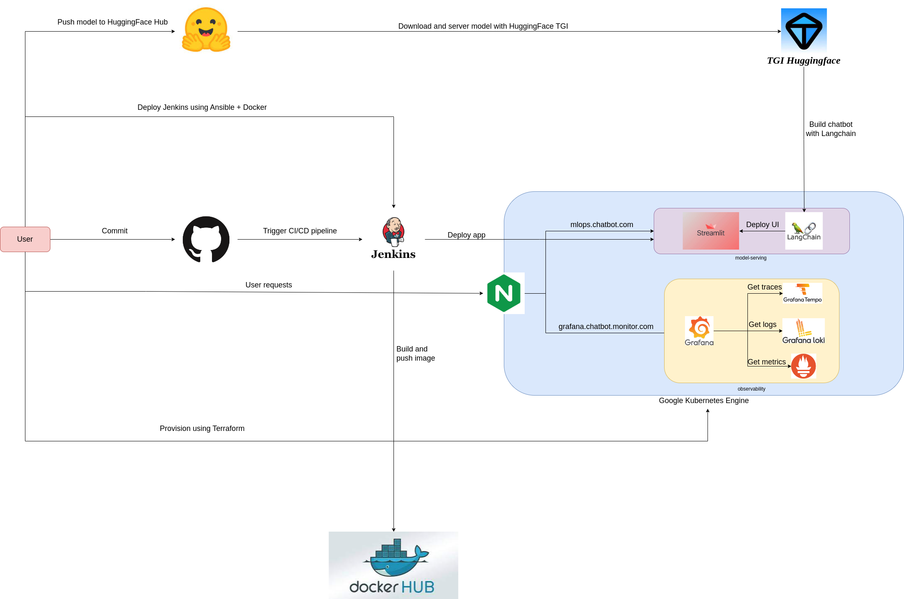
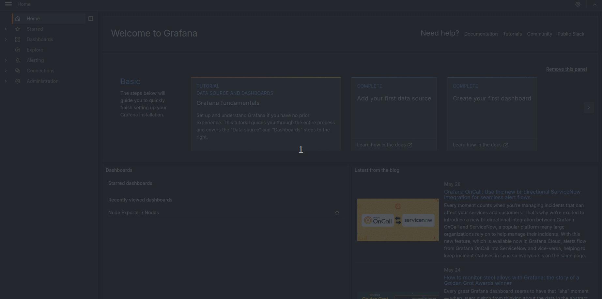

# Simple CI/CD pipeline for LLM in production using Google Kubernetes Engine.
## System Architecture

# Table of Contents

1. [Create GKE Cluster](#1-create-gke-clusterCreate-GKE-Cluster)
2. [Deploy serving service manually](#2-deploy-serving-service-manually)

    1. [Deploy nginx ingress controller](#21-deploy-nginx-ingress-controller)

    2. [Deploy application](#22-deploy-application-to-gke-cluster-manually)

3. [Deploy monitoring service](#3-deploy-monitoring-service)

    1. [Deploy Prometheus service](#31-deploy-prometheus-service)

    2. [Deploy Grafana service](#32-deploy-grafana-service)


4. [Continuous deployment to GKE using Jenkins pipeline](#4-continuous-deployment-to-gke-using-jenkins-pipeline)

    1. [Create Google Compute Engine](#41-spin-up-your-instance)

    2. [Install Docker and Jenkins in GCE](#42-install-docker-and-jenkins)

    3. [Connect to Jenkins UI in GCE](#43-connect-to-jenkins-ui-in-compute-engine)

    4. [Setup Jenkins](#44-setup-jenkins)

    5. [Continuous deployment](#45-continuous-deployment)
## 1. Create GKE Cluster
### How-to Guide

#### 1.1. Create [Project](https://console.cloud.google.com/projectcreate) in GCP
#### 1.2. Install gcloud CLI
Gcloud CLI can be installed following this document https://cloud.google.com/sdk/docs/install#deb

Initialize the gcloud CLI
```bash
gcloud init
Y
```
+ A pop-up to select your Google account will appear, select the one you used to register GCP, and click the button Allow.

+ Go back to your terminal, in which you typed `gcloud init`, pick cloud project you using, and Enter.

+ Then type Y, type the ID number corresponding to **asia-southeast1-b** (in my case), then Enter.

#### 1.3. Install gke-cloud-auth-plugin
```bash
sudo apt-get install google-cloud-cli-gke-gcloud-auth-plugin
```

#### 1.4. Using [terraform](https://developer.hashicorp.com/terraform/tutorials/aws-get-started/install-cli) to create GKE cluster.
Update your [project id](https://console.cloud.google.com/projectcreate) in `terraform/variables.tf`
Run the following commands to create GKE cluster:
```bash
gcloud auth application-default login
```

```bash
cd iac/terraform
terraform init
terraform plan
terraform apply
```
+ GKE cluster is deployed at **asia-southeast1-b** with its node machine type is: **e2-standard-4** (4 CPU, 16 GB RAM and costs 128$/1month).
+ Unable [Autopilot](https://cloud.google.com/kubernetes-engine/docs/concepts/autopilot-overview) for the GKE cluster. When using Autopilot cluster, certain features of Standard GKE are not available, such as scraping node metrics from Prometheus service.

It can takes about 10 minutes for create successfully a GKE cluster. You can see that on [GKE UI](https://console.cloud.google.com/kubernetes/list)


#### 1.5. Connect to the GKE cluster.
+ Go back to the [GKE UI](https://console.cloud.google.com/kubernetes/list).
+ Click on vertical ellipsis icon and select **Connect**.
You will see the popup Connect to the cluster as follows

+ Copy the line `gcloud container clusters get-credentials ...` into your local terminal.

After run this command, the GKE cluster can be connected from local.
```bash
kubectx [YOUR_GKE_CLUSTER_ID]
```
## 2. Deploy serving service manually
Using [Helm chart](https://helm.sh/docs/topics/charts/) to deploy application on GKE cluster.

### How-to Guide

#### 2.1. Deploy nginx ingress controller
```bash
cd helm/nginx_ingress
kubectl create ns nginx-ingress
kubens nginx-ingress
helm upgrade --install nginx-ingress-controller .
```
After that, nginx ingress controller will be created in `nginx-ingress` namespace.

#### 2.2. Deploy application to GKE cluster manually
Our chatbot is deployed by Langchain and Streamlit.
The UI can be accessed by the host which is defined in `helm/model-serving/templates/nginx-ingress.yaml`.

```bash
cd helm/model-serving
kubectl create ns model-serving
kubens model-serving
helm upgrade --install chatbot .
```

After that, application will be deployed successfully on GKE cluster. To test the api, you can do the following steps:

+ Obtain the IP address of nginx-ingress.
```bash
kubectl get ing
```

+ Add the domain name `mlops.chatbot.com` (set up in `helm/model-serving/templates/nginx-ingress.yaml`) of this IP to `/etc/hosts`
```bash
sudo nano /etc/hosts
[YOUR_INGRESS_IP_ADDRESS] mlops.chatbot.com
```

+ Open web brower and type `mlops.chatbot.com` to access the Streamlit UI and test the API.
    
  Here, users can upload pdf files which demonstrate about the topic supposed to discuss and start to chat.

## 3. Deploy monitoring service
I'm using Prometheus, Grafana, Loki, Tempo and OpenTelemetry for monitoring the health of both Node and pods that running application.

Prometheus will scrape metrics from both Node and pods in GKE cluster, Loki will collect logs, Tempo and OpenTelemetry will export traces. Subsequently, Grafana will show us all the logs, traces and metrics we need to monitor our systems.

Similar to Streamlit UI, Grafana UI can be accessed by the host which is defined in `helm/monitor/grafana-prometheus.yaml`.
### How-to Guide
Firstly, let go to `helm/monitor` directory.
+ Deploy Prometheus and Grafana.
```bash
kubectl create namespace observability
helm repo add prometheus-community https://prometheus-community.github.io/helm-charts
helm upgrade --install monitor-stack prometheus-community/kube-prometheus-stack --values grafana-prometheus.yaml -n observability 
```

+ Deploy Loki and FlentBit
```bash
helm repo add grafana https://grafana.github.io/helm-charts
helm install -f loki.yaml loki grafana/loki-stack -n observability
```

+ Deploy Tempo and OpenTelemetry
```bash
helm install tempo grafana/tempo -f tempo.yaml -n observability
helm repo add open-telemetry https://open-telemetry.github.io/opentelemetry-helm-charts
helm install opentelemetry-collector open-telemetry/opentelemetry-collector -f collector.yaml -n observability
```

After that, to access Grafana UI, you can do the following steps:
+ Obtain the IP address of nginx-ingress.
```bash
kubectl get ing
```

+ Add the domain name `grafana.chatbot.monitor.com` (set up in `helm/monitor/grafana-prometheus.yaml`) of this IP to `/etc/hosts`
```bash
sudo nano /etc/hosts
[YOUR_INGRESS_IP_ADDRESS] grafana.chatbot.monitor.com
```

+ Open web brower and type `grafana.chatbot.monitor.com` to access the Grafana UI.
    


## 4. Continuous deployment to GKE using Jenkins pipeline

Jenkins is deployed on Google Compute Engine using [Ansible](https://docs.ansible.com/ansible/latest/playbook_guide/playbooks_intro.html) with a machine type is **e2-highmem-4**.

### 4.1. Spin up your instance
Create your [service account](https://console.cloud.google.com/iam-admin/serviceaccounts), and select `Compute Admin` role (Full control of all Compute Engine resources) for your service account.

Create new key as json type for your service account. Download this json file and save it in `iac/ansible/secrets` directory. 

Go back to your terminal, please execute the following commands to create the Compute Engine instance:
```bash
cd iac/ansible/
ansible-playbook create_compute_instance.yaml
```

Go to Settings, select [Metadata](https://console.cloud.google.com/compute/metadata) and add your SSH key.

Update the IP address of the newly created instance and the SSH key for connecting to the Compute Engine in the inventory file.


### 4.2. Install Docker and Jenkins in GCE
Firstly, let install docker and change its data root to /dev/shm where we can store our [chatbot docker image](https://hub.docker.com/repository/docker/hoanglong2410/chatbot/general).
```bash
ansible-playbook -i ../inventory dinstall_and_change_docker_data_root.yaml
```
After that, let pull jenkins image.
```bash
ansible-playbook -i ../inventory pull_jenkins_image.yaml
```
Wait a few minutes, if you see the output like this it indicates that Jenkins has been successfully installed on a Compute Engine instance.

### 4.3. Connect to Jenkins UI in Compute Engine
Access the instance using the command:
```bash
ssh -i ~/.ssh/id_rsa YOUR_USERNAME@YOUR_EXTERNAL_IP
```

Open web brower and type `[YOUR_EXTERNAL_IP]:8081` for access Jenkins UI. To Unlock Jenkins, please execute the following commands:
```shell
sudo docker exec -ti jenkins cat /var/jenkins_home/secrets/initialAdminPassword
```
Copy the password and you can access Jenkins UI.

It will take a few minutes for Jenkins to be set up successfully on their Compute Engine instance.


Create your user ID, and Jenkins will be ready :D

### 4.4. Setup Jenkins
#### 4.4.1. Connect to Github repo
+ Add Jenkins url to webhooks in Github repo


+ Add Github credential to Jenkins (select appropriate scopes for the personal access token)


#### 4.4.2. Add `PINECONE_APIKEY` for connecting to Pinecone Vector DB in the global environment varibles at `Manage Jenkins/System`


#### 4.4.3. Add Dockerhub credential to Jenkins at `Manage Jenkins/Credentials`


#### 4.4.4. Install the Kubernetes, Docker, Docker Pineline, GCloud SDK Plugins at `Manage Jenkins/Plugins`

After successful installation, restart the Jenkins container in your Compute Engine instance:
```bash
sudo docker restart jenkins
```


#### 4.4.5. Set up a connection to GKE by adding the cluster certificate key at `Manage Jenkins/Clouds`.

Don't forget to grant permissions to the service account which is trying to connect to our cluster by the following command:

```shell
kubectl create clusterrolebinding cluster-admin-binding --clusterrole=cluster-admin --user=system:anonymous

kubectl create clusterrolebinding cluster-admin-default-binding --clusterrole=cluster-admin --user=system:serviceaccount:model-serving:default
```


#### 4.4.6. Install Helm on Jenkins to enable application deployment to GKE cluster.

+ You can use the `Dockerfile-jenkins-k8s` to build a new Docker image. After that, push this newly created image to Dockerhub. Finally replace the image reference at `containerTemplate` in `Jenkinsfile` or you can reuse my image `duong05102002/jenkins-k8s:latest`


### 4.5. Continuous deployment
Create `model-serving` namespace first in your GKE cluster
```bash
kubectl create ns model-serving
```

The CI/CD pipeline will consist of three stages:
+ Tesing model correctness.
    + Replace the new pretrained model in `app/main.py`. I recommend accessing the pretrained model by downloading it from another storage, such as Google Drive or Hugging Face.
    + If you store the pretrained model directly in a directory and copy it to the Docker image during the application build, it may consume a significant amount of resource space (RAM) in the pod. This can result in pods not being started successfully.
+ Building the image, and pushing the image to Docker Hub.
+ Finally, it will deploy the application with the latest image from DockerHub to GKE cluster.


The pipeline will take about 8 minutes. You can confirm the successful deployment of the application to the GKE cluster if you see the following output in the pipeline log:


Here is the Stage view in Jenkins pipeline:


Check whether the pods have been deployed successfully in the `models-serving` namespace.


Test the API


